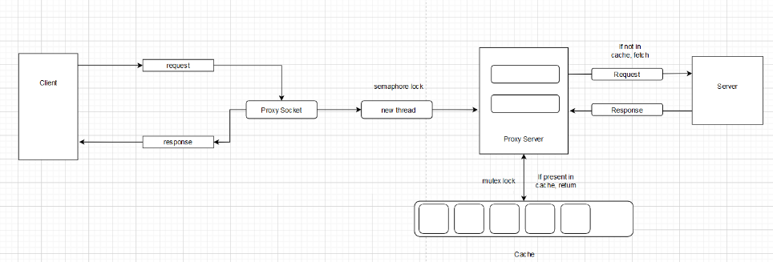
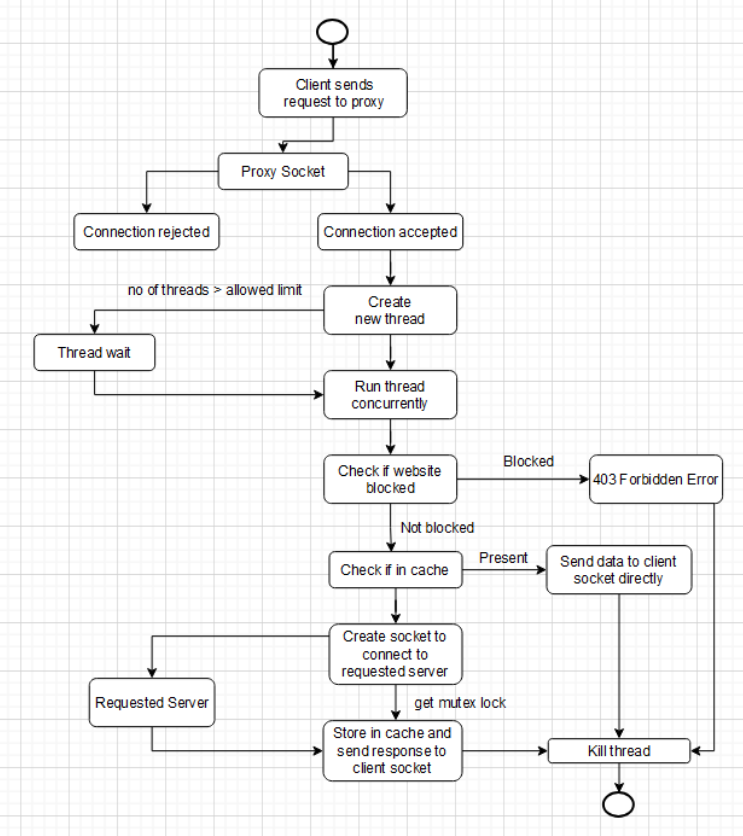

# Proxy Server with Caching and Concurrent Connections

## Overview

This project implements a concurrent proxy server with caching and decompression mechanisms, which handles client requests, communicates with remote servers, caches data for faster access, and efficiently manages concurrent connections. The server is designed to handle multiple clients simultaneously, ensuring optimal performance through the use of threads, semaphores, and mutexes.

### Features

- **Concurrent Client Handling**: The server can handle multiple clients simultaneously through threading.
- **Caching**: Frequently requested data is cached to reduce the load on remote servers and improve response time.
- **Decompression**: The proxy decompresses data when required, using the zlib library.
- **Error Handling**: Custom error pages are generated for failed requests to inform users of the issue.
- **Request Management**: The server checks if a requested resource is available in the cache before forwarding the request to the remote server.

## Table of Contents

1. [Installation](#installation)
2. [Usage](#usage)
3. [Architecture](#architecture)
   - [Main Function](#main-function)
   - [Thread Function](#thread-function)
   - [Handle Request](#handle-request)
   - [Caching Mechanism](#caching-mechanism)
   - [Decompression](#decompression)
   - [Error Handling](#error-handling)
4. [Dependencies](#dependencies)
5. [License](#license)

## Installation

**Note**: This proxy server is designed to run only on Linux-based machines.

To run the proxy server on your machine, follow the steps below:

1. **Clone the repository:**
  ```bash
   git clone https://github.com/Srinidhi-Yoganand/proxyServer.git
   ```

2. **Navigate to the project directory:**
  ```bash
  cd proxyServer
  ```
3. **Build the project:**
  ```bash
  make
  ```
4. **Run the proxy server:**
  ```bash
  make run
  ```
  Or
  ```
  ./proxy_server 8080
  ```

The server will start listening on port 8080 by default.

## Usage

Once the proxy server is up and running, configure your browser or HTTP client to use the proxy server with the following settings:

- **Proxy Host**: `localhost`
- **Proxy Port**: `8080`

Now, you can use your browser or HTTP client to send requests through the proxy server, which will either fetch the data from the cache or request it from the remote server.

## Architecture

Here’s an overview of how the proxy server architecture works:



### 1. Main Function

The main function sets up and initializes the server, handling the following tasks:

#### Initialization:
- A semaphore and mutex are initialized to control access to shared resources.
- A server socket is created and set up to accept incoming client connections on port `8080`.

#### Listening and Handling Connections:
- The server listens for incoming client connections.
- Upon accepting a connection, a new thread is spawned to handle the client request, and the server socket continues to listen for new connections.

### 2. Thread Function

The thread function is responsible for handling individual client requests.

#### Client Request Handling:
- A semaphore lock is acquired to control the number of concurrent client connections.
- A buffer is created to receive data from the client.
- The server waits for the client to send `\r\n\r\n`, marking the end of the request.

#### Cache Check:
The proxy checks if the requested resource is available in the cache:
- **If Found**: The cached data is sent to the client.
- **If Not Found**: The request is passed to the `handle_request` function for processing.

#### Connection Shutdown:
- After responding to the client, the connection is closed, and the semaphore lock is released.

### 3. Handle Request

The `handle_request` function manages the communication between the proxy and the remote server.

#### Host Check:
The proxy checks whether the requested host is blocked. If it is not blocked, the server proceeds with establishing a connection.

#### Remote Request:
- The proxy prepares a buffer for the remote server's request, opens a socket, and sends the request to the remote server.
- As the response is received from the remote server, the proxy relays the data back to the client in chunks.
- Once the response is fully received, the data is added to the cache.

### 4. Caching Mechanism

The cache is implemented as a linked list with the following features:

#### Cache Structure:
- Each cache node contains the URL, data, data length, last accessed time, and a pointer to the next node.
- The cache has a maximum size of `200MB`, and the maximum size of each cached element is `20MB`.

#### Cache Search:
The proxy searches for the requested data in the cache. If found, the last access time is updated, and the data is returned to the client.

#### Adding to Cache:
- The proxy decompresses the data (if necessary) before adding it to the cache.
- The proxy acquires a mutex lock, checks if there is room in the cache, and removes the least recently used (LRU) item if needed.

#### Cache Deletion:
The LRU item is removed from the cache if the cache exceeds its maximum size.

### 5. Decompression

The proxy uses the `zlib` library to decompress data that is compressed (e.g., using gzip). The data is decompressed in chunks and stored in a buffer before being sent to the client.

### 6. Error Handling

If an error occurs during request handling or server communication, the proxy generates a custom HTML error page that provides details about the issue to the client.

## Dependencies

- **C Compiler**: Required to compile the source code (e.g., `gcc`).
- **pthread Library**: Used for multi-threading and concurrent client handling.
- **zlib Library**: Used for decompressing data (e.g., gzip compression).

## License

This project is licensed under the MIT License. See the [LICENSE](LICENSE) file for more details.

## Example Workflow

1. **Client Request**: A client sends an HTTP request to the proxy server.
2. **Cache Check**: The proxy checks if the requested data is cached.
   - **If cached**: The data is returned to the client.
   - **If not cached**: The proxy forwards the request to the remote server.
3. **Handling Remote Request**: The proxy fetches the data from the remote server, decompresses it if necessary, and stores it in the cache.
4. **Client Response**: The proxy sends the data back to the client and updates the cache.

  